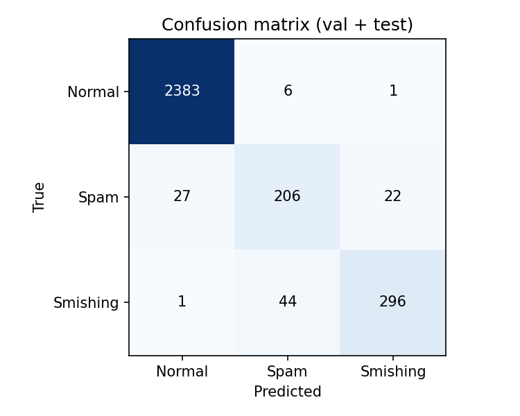
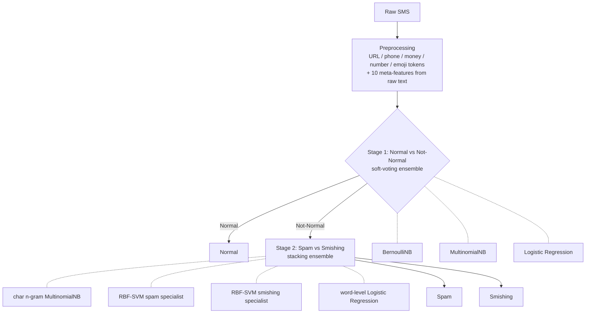

# 📱 SMS Smishing Classifier

[](https://github.com/linjunway/sms-smishing-classifier/actions)
   

A production-style ML service that classifies an SMS as **Normal**, **Spam** or **Smishing** (SMS phishing).
Trained on fewer than 3,000 messages with classical scikit-learn models only, it reaches **96.6 % accuracy** and
**89.1 % balanced accuracy** on a held-out set of 2,986 messages, and is served through a **FastAPI** REST API,
a **Streamlit** demo and **Docker**.

## Results

Held-out evaluation (1,493 validation + 1,493 test messages, never used for fitting):

| Split | Accuracy | Balanced acc. | Macro F1 | F1 Normal | F1 Spam | F1 Smishing |
|-------|---------:|--------------:|---------:|----------:|--------:|------------:|
| Val   | 96.72 %  | 89.00 %       | 0.902    | 0.991     | 0.802   | 0.914       |
| Test  | 96.52 %  | 89.19 %       | 0.895    | 0.994     | 0.811   | 0.880       |
| **All** | **96.62 %** | **89.10 %** | **0.899** | 0.993 | 0.806 | 0.897 |



Normal messages are almost never flagged (7 errors in 2,390). Most remaining errors (66 of 101) are Spam ↔ Smishing
confusions, which is expected: both are unsolicited promotional text, and smishing differs mainly in intent
(impersonation + a call to action). Re-generate every number with `make train` → `reports/metrics.json`.

## Architecture



**Why hierarchical?** The classes are heavily imbalanced (82 % Normal). Splitting the problem lets stage 1 specialise in
the easy, high-volume Normal-vs-rest boundary (word features tuned with a minimal stopword list, because words like
"to"/"your" carry signal), while stage 2 trains only on the ~530 harder minority examples using character n-grams that
are robust to the obfuscated spelling common in spam.

**Feature engineering.** URLs, phone numbers, currency amounts, numbers and emoji are replaced with tokens (shrinking
the vocabulary while keeping the signal), and urgency features (ALL-CAPS words, `!` count, digit count, URL/phone/currency
counts, …) are computed on the *raw* text before cleaning.

## Quickstart

### Docker (recommended)

```bash
docker compose up --build
```

| Service | URL |
|---|---|
| REST API + interactive docs | http://localhost:8000/docs |
| Streamlit demo | http://localhost:8501 |

The API image trains the model at build time, so the artefact always matches the pinned scikit-learn version.

### Local

```bash
python -m venv .venv && source .venv/bin/activate
make install        # pip install -e ".[dev,app]"
make train          # trains, evaluates, writes models/model.joblib + reports/
make api            # http://localhost:8000/docs
make demo           # http://localhost:8501  (needs the API running)
make test           # pytest
```

## Deploying the demo

The Streamlit app has two modes, chosen automatically:

| Mode | When | What happens |
|---|---|---|
| **API mode** | `API_URL` is set (env var or Streamlit secret) | The UI sends HTTP requests to the FastAPI service. `docker-compose.yml` uses this. |
| **Standalone mode** | `API_URL` is not set | The UI loads the model in-process (training it on first start if `models/model.joblib` is missing). |

**Streamlit Community Cloud** runs only the Streamlit script, not Docker, so use standalone mode: create the app from this repo
with main file `app/streamlit_app.py` (it installs from the root `requirements.txt`). To run the full two-service architecture
instead, deploy the API image (`Dockerfile`) to any container host, e.g. Render, then add
`API_URL = "https://your-api.onrender.com"` under the app's **Settings → Secrets**.

## API

```bash
curl -X POST localhost:8000/predict -H 'content-type: application/json' \
  -d '{"text": "Your parcel is on hold. Pay the customs fee at http://dhl-pay.xyz/a1 now!"}'
```

```json
{
  "label": 2,
  "label_name": "Smishing",
  "confidence": 0.7892,
  "probabilities": {"Normal": 0.0381, "Spam": 0.1727, "Smishing": 0.7892},
  "signals": {"urls": 1, "phone_numbers": 0, "currency_symbols": 0, "all_caps_words": 0, "exclamation_marks": 1}
}
```

| Method | Path | Description |
|---|---|---|
| `POST` | `/predict` | Classify one message (1–1600 chars) |
| `POST` | `/predict/batch` | Classify up to 100 messages |
| `GET` | `/health` | Liveness + model-loaded check (used by Docker `HEALTHCHECK`) |
| `GET` | `/model-info` | Evaluation metrics from the last training run |

Probabilities come from the chain rule over the two stages: `P(Normal)=1-p₁`, `P(Spam)=p₁·p₂(Spam)`,
`P(Smishing)=p₁·p₂(Smishing)`. The label follows the hierarchical decision rule, so in rare borderline cases it can
differ from the arg-max of these probabilities.

## Engineering notes

- **One preprocessing path** (`preprocessing.py`) shared by training, evaluation and serving, so there is no train/serve skew;
  evaluation runs through the same `SMSClassifier` wrapper the API uses.
- **Python `re` instead of `pandas.str`**: pandas ≥ 3 can route regexes through Arrow's RE2, whose `\w`/`\b` are ASCII-only
  and would silently change features. Plain `re` keeps behaviour identical across versions.
- **Reproducibility**: fixed seeds, pinned dependency versions, deterministic data-curation step
  (label-conflict resolution, de-duplication, empty-after-cleaning removal).
- **Tests** (`pytest`, 15): preprocessing, model contracts (probabilities sum to 1, empty-message fallback) and every API
  endpoint including validation errors. CI runs lint + tests, then builds the Docker image and smoke-tests the container.

## Project layout

```
src/smsclf/   config · preprocessing · data · model · classifier (inference) · train · api
app/          Streamlit demo (+ Dockerfile)
tests/        pytest suite
data/         training and held-out evaluation files
reports/      metrics.json, confusion_matrix.png
Dockerfile · docker-compose.yml · Makefile · .github/workflows/ci.yml
```

## Limitations & next steps

- Small, single-source dataset: results will not transfer to other regions/languages/carriers without re-training.
  Spam vs Smishing (~F1 0.80–0.90) is the weak spot and the first place more labelled data would help.
- Confidence values are not calibrated; add `CalibratedClassifierCV` before using thresholds for decisions.
- Ideas: k-fold CV report, SHAP/feature-importance explanations, request logging + Prometheus metrics, a transformer baseline for comparison.
